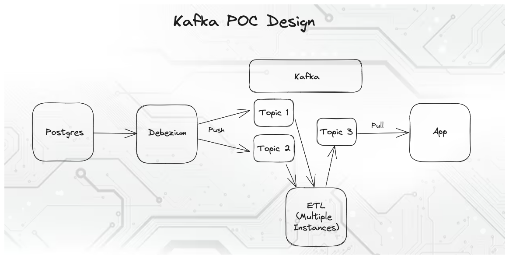

# Kafka POC

Proof of concept work for a streaming app - idea is to stream changes from a database into a fuzzy search app.



Components:
- Postgres: Where the data originally resides
- Debezium: Producer that connects Postgres to Kafka
- Kafka: Stream processing platform
- ETL: Moves data through Kafka, cleaning and preparing it for ingestion by the app
- App: Consumer that pulls data from Kafka into LevelDB locally and creates an FST for fuzzy searching

Managed by the top-level `docker compose`, which contains images for the components above as well as UIs for Kafka and Debezium.

To spin up the services run `docker compose up -d --build`, possible omitting `-d` if you don't want to run in detached mode.
The ETL workers can be scaled up by using the `--scale` flag when spinning up the services, `docker compose up -d --build --scale etl=3`.
The services can be spun down using `docker compose down`.

To connect Postgres to Debezium send the provided config to Debezium via `curl`:
```bash
curl -i -X POST -H "Accept:application/json" -H "Content-Type:application/json" localhost:9090/connectors/ -d @data/debezium-pg-config.json
```

Additional data can be added to Postgres via the provided CSV files:
```bash
psql -U postgres -h localhost -c "\copy member.address FROM 'data/more-addresses.csv' CSV HEADER"
psql -U postgres -h localhost -c "\copy member.name FROM 'data/more-names.csv' CSV HEADER"
```
